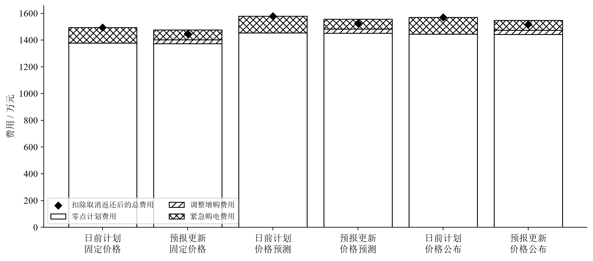

# CUMCM 2026 C 题：微网购电与储能滚动调度

这是一个从竞赛工作区中抽取出的、无旧 Git 历史的公开复现仓库。它提供微网购电、储能调度、滚动预测更新、分段结算和年度策略比较的原创 Python 实现。

> 本仓库不是竞赛官方网站，也不是标准答案。赛题、官方附件、论文模板、第三方全文文献、参赛论文和提交包均不在仓库中；请从官方渠道取得允许使用的输入，并自行确认公开时点符合学校、赛区和竞赛要求。



## 能复现什么

- 10 分钟时间步的功率平衡与储能状态转移；
- 日前计划、6/12/18 时更新、固定/预测/当日公布电价三类信息情景；
- 计划增购、取消返还和紧急购电的独立费用核算；
- 对未来真实数据的扰动测试，用于检查决策的信息截止边界；
- 334 日、39 组策略的断点续算、并行执行和结果校验；
- 六类主策略的参考汇总与由代码生成的图。

参考结果只对应指定输入、参数和信息假设，不代表一般意义上的最优政策或真实部署收益。模型和验证边界见 [模型与限制](docs/MODEL_AND_LIMITS.md)。

## 快速开始

使用 Conda：

```bash
conda env create -f environment.yml
conda activate cumcm26-open
python scripts/smoke_synthetic.py
python -m pytest -q
```

或使用 Python 3.12：

```bash
python -m venv .venv
source .venv/bin/activate
python -m pip install -e '.[test,reproduce]'
python scripts/smoke_synthetic.py
python -m pytest -q
```

没有官方输入时，合成数据测试会运行，依赖官方附件的集成测试会明确跳过。

## 准备官方输入

1. 从[全国大学生数学建模竞赛官网](https://www.mcm.edu.cn/html_cn/block/8579f5fce999cdc896f78bca5d4f8237.html)取得 2026 C 题附件。
2. 按 [`c_grid/attachments/README.md`](c_grid/attachments/README.md) 放置文件。
3. 核验输入：

```bash
python scripts/verify_inputs.py
```

输入齐全后运行集成测试和完整计算：

```bash
python -m pytest -q
python scripts/run_online_dispatch.py \
  --workers 4 \
  --output outputs/reproduction \
  --resume
python scripts/validate_online_results.py --run outputs/reproduction
python scripts/online_report.py --run outputs/reproduction --export
```

完整年度计算耗时取决于 CPU、求解器和场景数。每个策略内部按时间顺序执行；`--resume` 只接受相同输入、源码和配置指纹。

## 目录

```text
.
├── c_grid/src/              # 模型、数据边界和结算源码
├── c_grid/attachments/      # 用户自行放置的官方输入（Git 忽略）
├── scripts/                 # 运行、验证、导出与发布门禁
├── tests/                   # 无数据单元测试和可选集成测试
├── data/INPUTS.sha256       # 官方输入文件指纹，不含文件本体
├── results/                 # 精简参考汇总与可复现图
└── docs/                    # 模型边界、来源和发布清单
```

## 公开边界

本仓库不包含：

- 竞赛题面、官方 Excel/Word/PDF、论文格式模板；
- CNKI、IEEE、ScienceDirect 等来源的文献全文；
- 参赛论文、支撑材料、Notebook 历史、云端凭据或运行归档；
- 原私有仓库的 Git 历史和已删除的 B 题模拟器资产。

详细说明见 [第三方材料声明](THIRD_PARTY_NOTICES.md) 和 [公开边界](docs/OPEN_SOURCE_BOUNDARY.md)。发布前运行：

```bash
python scripts/check_public_boundary.py
```

## 参与贡献

请先阅读 [CONTRIBUTING.md](CONTRIBUTING.md)。安全问题按 [SECURITY.md](SECURITY.md) 报告。

## 许可

本仓库收录的原创代码与文档采用 [MIT License](LICENSE)。该许可不覆盖未随仓库分发的竞赛官方材料、第三方论文、字体、模板或其他外部作品。

English overview: [README.en.md](README.en.md).

